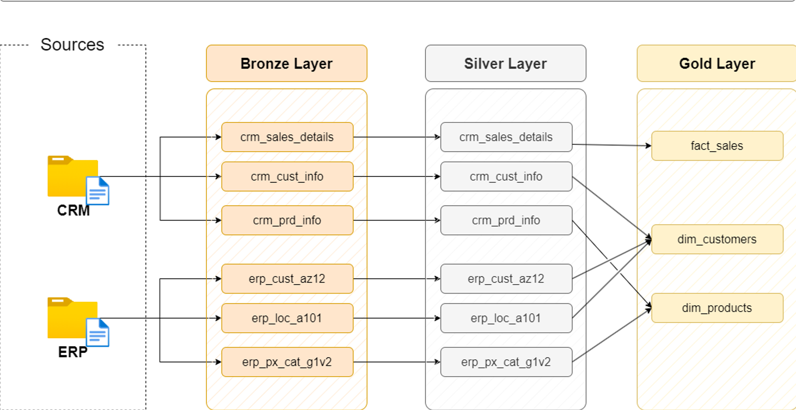
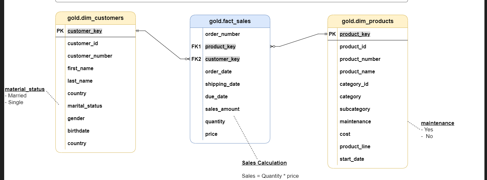

# SQL Data Warehouse Project

A complete SQL Server data warehouse project built using the **Bronze, Silver, and Gold architecture**.

This project demonstrates data loading, cleaning, transformation, dimensional modelling, and data-quality testing using CRM and ERP source data.

## Data Architecture



- **Bronze Layer:** Stores raw data imported from CSV files.
- **Silver Layer:** Cleans, standardizes, and transforms the data.
- **Gold Layer:** Provides business-ready fact and dimension views.

## Data Model



The Gold layer uses a star schema with:

- `gold.fact_sales`
- `gold.dim_customers`
- `gold.dim_products`

## Project Work

- Created Bronze, Silver, and Gold schemas
- Loaded CRM and ERP data from CSV files
- Cleaned missing, duplicate, and invalid values
- Standardized customer, product, and sales data
- Created stored procedures for data loading
- Built fact and dimension views
- Performed data-quality checks
- Created architecture and data-model diagrams

## Tools Used

- SQL Server
- SQL Server Management Studio
- T-SQL
- CSV files
- Draw.io
- GitHub

## Project Structure

```text
sql-data-warehouse-project/
│
├── docs/
│   ├── data_architecture.png
│   └── data_model.png
│
├── scripts/
│   ├── init_database.sql
│   ├── bronze/
│   ├── silver/
│   └── gold/
│
├── tests/
│   ├── quality_checks_silver.sql
│   └── quality_checks_gold.sql
│
└── README.md
```

## How to Run

1. Open SQL Server Management Studio.
2. Run `scripts/init_database.sql`.
3. Run the Bronze-layer scripts.
4. Execute `bronze.load_bronze`.
5. Run the Silver-layer scripts.
6. Execute `silver.load_silver`.
7. Run the Gold-layer script.
8. Run the quality-check scripts from the `tests` folder.

Update the CSV file paths before running the Bronze loading procedure.

## Credits

This project was completed for learning and portfolio purposes by following the **SQL Data Warehouse Project by Data With Baraa**.

## Author

**Adnan Aslam**  
Bachelor of Business Data Analytics student interested in SQL, data analytics, business intelligence, and data engineering.
